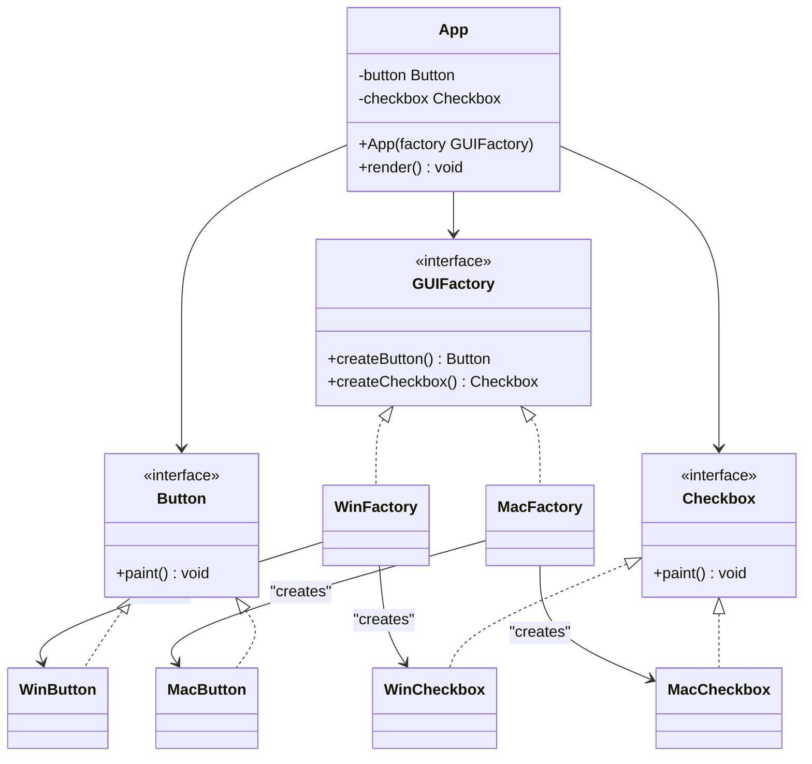
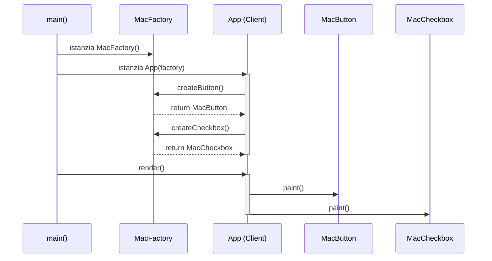

# Implementazione Java: Abstract Factory

## Scenario
Toolkit di componenti grafici (UI) multipiattaforma. L'interfaccia deve supportare **Windows** e **macOS**. Mescolare pulsanti Mac con checkbox Windows genererebbe errori visivi. L'Abstract Factory garantisce che venga usata l'intera famiglia stilistica corretta.

## Struttura Specifica (UML delle Classi)

## Diagramma di Sequenza
Questo diagramma mostra come il Client (`App`) interagisce con la Factory per istanziare i prodotti astratti a runtime (es. ambiente macOS).

## Spiegazione dell'Implementazione
1.  **Astrazioni:** Interfacce per `Button`, `Checkbox` e la fabbrica `GUIFactory`.
2.  **Specializzazione:** Implementazioni concrete (`WinButton`, `WinFactory`, ecc.).
3.  **Iniezione (Dependency Inversion):** Il `main` valuta il sistema operativo a runtime, istanzia l'unica Factory concreta necessaria e la passa al Client (`App`), che lavora solo con interfacce astratte.
