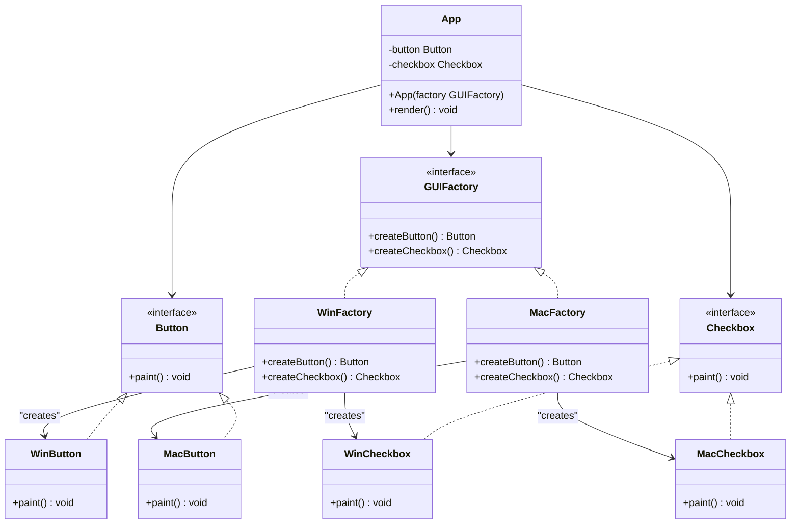

# Abstract Factory

## Descrizione
L'**Abstract Factory** è un design pattern creazionale che fornisce un'interfaccia per creare famiglie di oggetti correlati o dipendenti, senza specificare le loro classi concrete. Consente a un sistema di essere indipendente dalle modalità di creazione, composizione e rappresentazione dei suoi prodotti.

## Motivazione (Uso e Scenario)
Quando un'applicazione deve supportare molteplici varianti di look-and-feel o configurazioni di prodotto (es. interfacce grafiche multipiattaforma, temi chiari/scuri, suite di driver per diversi database), è fondamentale evitare che il codice client sia costellato di blocchi condizionali (`if-else` o `switch`) legati a piattaforme specifiche.

### Scenario Reale
Immaginiamo di sviluppare un toolkit di componenti grafici (UI) che deve girare sia su **Windows** che su **macOS**. Un'interfaccia coerente richiede che se l'app gira su Windows, tutti i componenti (pulsanti, checkbox) debbano avere lo stile grafico di Windows. Mescolare un pulsante Mac con una checkbox Windows genererebbe un'esperienza utente errata ed errori visivi.

L'Abstract Factory risolve questo problema centralizzando la creazione di queste famiglie di prodotti correlati, garantendo l'allineamento stilistico e strutturale a runtime.

## Struttura (UML concettuale)

### Descrizione dei Componenti UML e Interazioni
*   **GUIFactory (Abstract Factory):** Definisce un set di metodi per la creazione di ciascuno dei prodotti astratti (pulsante e checkbox). Non implementa logica di business legata a una specifica piattaforma.
*   **WinFactory / MacFactory (Concrete Factories):** Implementano le operazioni della fabbrica astratta per istanziare oggetti concreti appartenenti a una specifica famiglia (es. `WinFactory` istanzierà esclusivamente `WinButton` e `WinCheckbox`).
*   **Button / Checkbox (Abstract Products):** Interfacce o classi astratte che definiscono le operazioni per una tipologia di prodotto.
*   **WinButton / MacButton / WinCheckbox / MacCheckbox (Concrete Products):** Classi specifiche che implementano le interfacce dei prodotti astratti. Rappresentano i prodotti finali di una determinata variante di piattaforma.
*   **App (Client):** Utilizza unicamente le interfacce esposte da `GUIFactory`, `Button` e `Checkbox`. Non sa (e non deve sapere) quali classi concrete vengano istanziate a runtime, garantendo il totale disaccoppiamento.

## Spiegazione dell'Implementazione
L'implementazione segue rigorosamente il principio dell'inversione delle dipendenze (*Dependency Inversion Principle*):
1.  **Dichiarazione delle Astrazioni:** Si definiscono le interfacce per i componenti atomici (`Button`, `Checkbox`) e l'interfaccia della fabbrica (`GUIFactory`).
2.  **Specializzazione delle Famiglie:** Vengono create le implementazioni concrete specifiche per piattaforma (es. il pacchetto Windows e il pacchetto Mac).
3.  **Iniezione della Factory nel Client (`App`):** In fase di startup dell'applicazione (`main`), si valuta l'ambiente circostante (tramite `System.getProperty("os.name")`) e viene istanziata l'unica Factory concreta necessaria. Questa istanza viene passata come parametro al costruttore della classe `App`. Da quel momento in poi, l'applicazione interagirà solo tramite contratti astratti.

## Conseguenze
Analisi dei pro e dei contro derivanti dall'adozione del pattern:
*   **Vantaggi:**
    *   **Isolamento delle classi concrete:** Il client non manipola mai direttamente i nomi delle classi di implementazione.
    *   **Consistenza tra prodotti:** Garantisce che i prodotti creati da una factory siano sempre compatibili e omogenei tra loro, evitando accoppiamenti errati a runtime.
    *   **Principio di Singola Responsabilità (SRP):** Il codice di creazione dei prodotti viene isolato in un unico punto, facilitando la manutenzione.
    *   **Principio Aperto/Chiuso (OCP):** È possibile introdurre nuove varianti di fabbriche e prodotti senza dover modificare il codice client esistente.
*   **Svantaggi:**
    *   **Flessibilità ridotta per nuovi tipi di prodotto:** Aggiungere un nuovo componente alla famiglia richiede la modifica dell'interfaccia `GUIFactory` e di tutte le classi concrete che la implementano.
    *   **Aumento della complessità:** Il pattern introduce molte nuove interfacce e classi, articolando la struttura del progetto.
