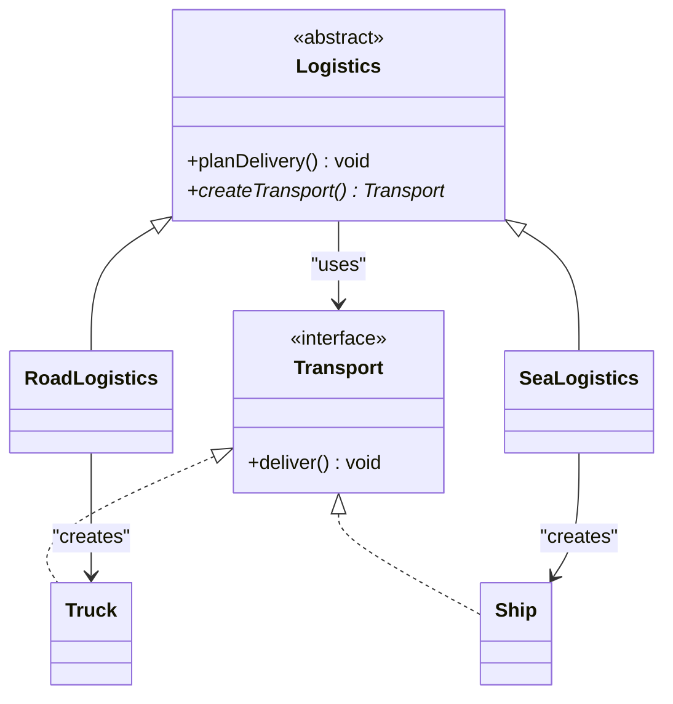

# Implementazione Java: Factory Method

## Scenario
Software per la gestione della **Logistica**. Inizialmente supporta solo trasporti su strada (camion). Viene richiesta l'integrazione del trasporto navale. Il Factory Method delega la creazione del mezzo di trasporto alla logistica specifica (Via terra o Via mare).

## Struttura Specifica (UML)

## Spiegazione dell'Implementazione
1.  **Product:** Interfaccia `Transport` con metodo `deliver()`.
2.  **Creator:** Classe base `Logistics` che implementa `planDelivery()` usando il metodo astratto `createTransport()`.
3.  **Sottoclassi:** `RoadLogistics` restituisce un `Truck`, `SeaLogistics` restituisce un `Ship`. A runtime, si usa il polimorfismo per eseguire la logica corretta.