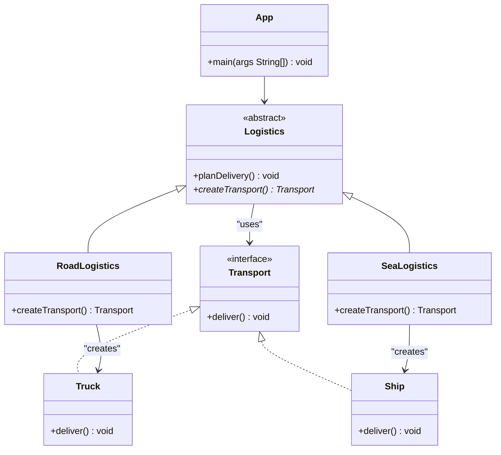

# Factory Method

## Descrizione
Il **Factory Method** è un design pattern creazionale che fornisce un'interfaccia per creare oggetti in una superclasse, ma consente alle sottoclassi di alterare il tipo di oggetti che verranno creati. Incapsula la logica di instanziazione in un metodo specifico (il "factory method" appunto), permettendo al codice client di interagire con le interfacce o le classi astratte piuttosto che con le implementazioni concrete.

## Motivazione (Uso e Scenario)
Spesso le applicazioni iniziano gestendo un singolo tipo di entità. Man mano che il sistema evolve, emerge la necessità di gestire nuove entità con comportamenti simili ma implementazioni diverse. Se il codice di creazione è sparso per l'applicazione, aggiungere nuove entità richiede la modifica di molteplici punti, violando i principi di buona progettazione.

### Scenario Reale
Immagina di sviluppare un software per la gestione della logistica. Inizialmente, la tua applicazione gestisce solo trasporti via terra e la maggior parte del codice vive all'interno di una classe `Truck` (Camion).
Dopo un po' di tempo, l'applicazione diventa popolare e le aziende di trasporto marittimo ti chiedono di integrare la logistica via mare.
Se il grosso del tuo codice è fortemente accoppiato alla classe `Truck`, aggiungere la classe `Ship` (Nave) richiederà di modificare pesantemente l'intera applicazione.
Il Factory Method risolve il problema sostituendo le chiamate dirette ai costruttori (tramite l'operatore `new`) con chiamate a un metodo factory speciale. Gli oggetti restituiti da questo metodo sono chiamati "prodotti".

## Struttura (UML concettuale)

### Descrizione dei Componenti UML e Interazioni
*   **Transport (Product):** Interfaccia comune a tutti gli oggetti che possono essere prodotti dal creator e dalle sue sottoclassi.
*   **Truck / Ship (Concrete Products):** Implementazioni diverse dell'interfaccia prodotto.
*   **Logistics (Creator):** Classe astratta che dichiara il metodo factory (che restituisce un oggetto di tipo `Transport`). Può anche contenere della logica di business principale che si affida agli oggetti `Transport` (es. `planDelivery()`).
*   **RoadLogistics / SeaLogistics (Concrete Creators):** Sovrascrivono il metodo factory base per restituire un diverso tipo di prodotto.
*   **App (Client):** Sceglie il creatore appropriato e ne invoca i metodi, interagendo con i prodotti creati sempre tramite l'interfaccia astratta `Transport`.

## Spiegazione dell'Implementazione
L'implementazione sfrutta il polimorfismo per delegare la creazione dell'oggetto corretto alle sottoclassi:
1.  **L'interfaccia del Prodotto:** Viene definita l'interfaccia `Transport` che garantisce la presenza del metodo `deliver()`.
2.  **La classe base Creator (`Logistics`):** Implementa la logica di business (`planDelivery()`) che necessita di un trasporto. Delega la creazione effettiva chiamando il suo metodo astratto `createTransport()`.
3.  **Specializzazione:** `RoadLogistics` implementa `createTransport()` restituendo un `Truck`, mentre `SeaLogistics` restituisce un `Ship`.
4.  **Client:** Inizializza il Creator specifico in base alla configurazione o all'input dell'utente e avvia il processo chiamando `planDelivery()`, il quale a sua volta utilizzerà internamente il prodotto corretto.

## Conseguenze
Analisi dei pro e dei contro derivanti dall'adozione del pattern:
*   **Vantaggi:**
    *   **Evita l'accoppiamento stretto (Tight Coupling):** Il creatore non è vincolato a classi di prodotti specifici.
    *   **Principio di Singola Responsabilità (SRP):** Sposti il codice di creazione del prodotto in un punto specifico del programma, rendendo il codice più facile da supportare.
    *   **Principio Aperto/Chiuso (OCP):** Puoi introdurre nuovi tipi di prodotti nel programma senza interrompere o modificare il codice client esistente.
*   **Svantaggi:**
    *   **Proliferazione di classi:** Il codice può diventare più complicato poiché è necessario introdurre un gran numero di nuove sottoclassi per implementare il pattern. La situazione ideale è quando si introduce il pattern in una gerarchia di classi Creator già esistente.
