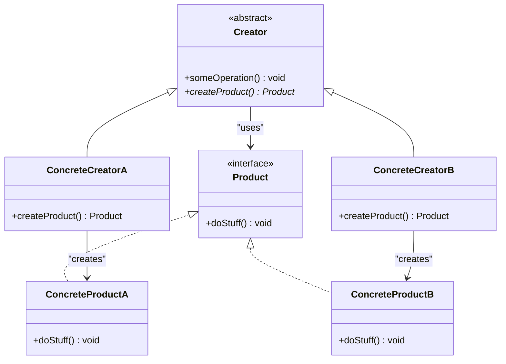

# Factory Method

## Descrizione
Il **Factory Method** è un design pattern creazionale che fornisce un'interfaccia per creare oggetti in una superclasse, ma consente alle sottoclassi di alterare il tipo di oggetti che verranno creati, delegando l'istanziazione.

## Motivazione (Uso e Scenario)
Se il codice di creazione di oggetti correlati ma diversi è sparso per l'applicazione, aggiungere nuove entità richiede la modifica di molteplici punti. Il Factory Method isola la creazione sostituendo le chiamate a `new` con chiamate a un metodo factory astratto.

## Struttura Generale (UML concettuale)

### Descrizione dei Componenti UML Generali
*   **Product:** Interfaccia comune a tutti gli oggetti prodotti.
*   **ConcreteProduct:** Implementazioni diverse dell'interfaccia prodotto.
*   **Creator:** Classe base che dichiara il factory method astratto e contiene logica di business che usa l'oggetto `Product`.
*   **ConcreteCreator:** Sovrascrive il factory method base per restituire un diverso tipo di prodotto concreto.

## Conseguenze
*   **Vantaggi:** Evita l'accoppiamento stretto, Single Responsibility Principle, Open/Closed Principle (facile aggiungere nuovi prodotti e creatori).
*   **Svantaggi:** Proliferazione di classi se applicato dove non c'è già una gerarchia di Creator naturale.