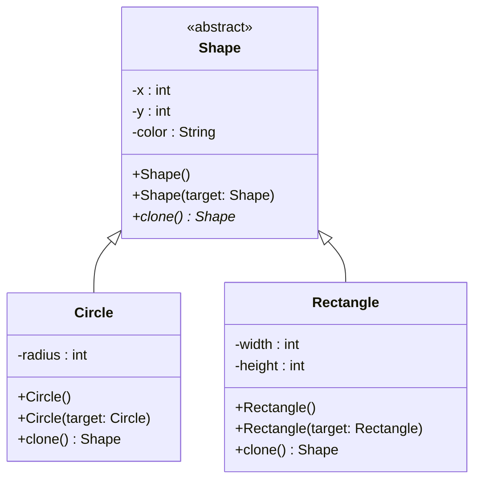
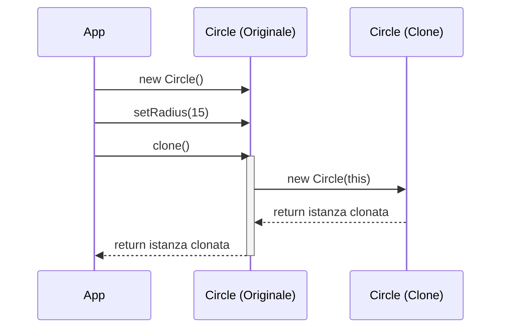

# Implementazione Java: Prototype

## Scenario
Editor di **Grafica Vettoriale**. L'utente ha configurato una forma complessa (cerchio o rettangolo) e vuole duplicarla. L'editor deve poter copiare le forme selezionate senza accoppiarsi alle loro classi specifiche.

## Struttura Specifica (UML delle Classi)

## Diagramma di Sequenza
Il diagramma mostra come il client duplica un oggetto senza sapere di che tipo sia, sfruttando il metodo `clone()` e il costruttore di copia.

## Spiegazione dell'Implementazione
In Java l'uso diretto di `Cloneable` può creare problemi legati alla copia superficiale. Pertanto, l'implementazione usa i **Costruttori di Copia**:
1.  `Shape` definisce i campi base e un costruttore che accetta un `Shape target` per copiarli.
2.  `Circle` e `Rectangle` hanno i propri costruttori di copia che chiamano `super(target)` per copiare le proprietà del genitore, per poi copiare i propri campi.
3.  Il metodo `clone()` semplicemente restituisce `new Circle(this)` o `new Rectangle(this)`.
