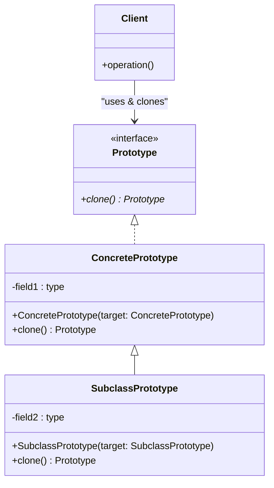

# Prototype

## Descrizione
Il **Prototype** è un design pattern creazionale che consente di copiare oggetti esistenti senza rendere il codice dipendente dalle loro classi concrete.

## Motivazione (Uso e Scenario)
Inizializzare un oggetto complesso da zero può essere oneroso. In più, il client potrebbe voler copiare un oggetto di cui conosce solo l'interfaccia, ignorando la classe concreta, o potrebbe non avere accesso ai suoi campi privati. Il Prototype risolve delegando la clonazione all'oggetto stesso.

## Struttura Generale (UML concettuale)

### Descrizione dei Componenti UML Generali
*   **Prototype:** Interfaccia o classe astratta che dichiara il metodo di clonazione (`clone()`).
*   **ConcretePrototype:** Implementa la clonazione. Spesso utilizza un "costruttore di copia" per trasferire tutti i valori (anche privati) dalla vecchia istanza alla nuova.
*   **Client:** Produce una copia di qualsiasi oggetto che segua l'interfaccia Prototype.

## Conseguenze
*   **Vantaggi:** Indipendenza dalle classi concrete, inizializzazione più rapida, utile per evitare sottoclassi infinite dedicate solo all'inizializzazione.
*   **Svantaggi:** Clonare oggetti con riferimenti circolari o strutture complesse a grafo ("Deep Copy") è notoriamente difficile.