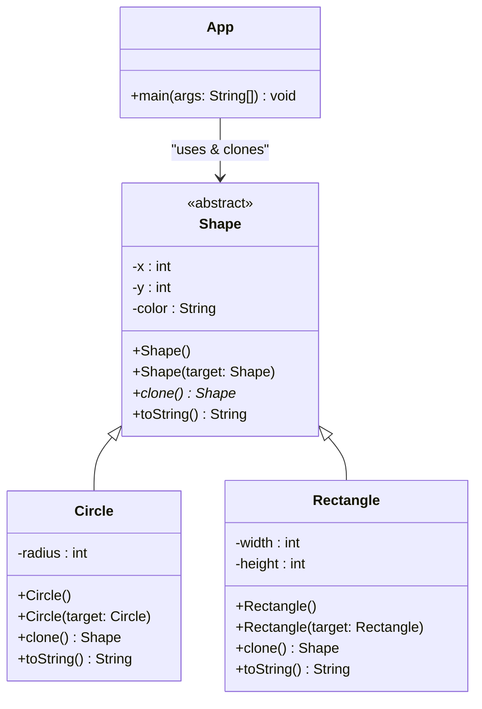

# Prototype

## Descrizione
Il **Prototype** è un design pattern creazionale che consente di copiare oggetti esistenti senza rendere il codice dipendente dalle loro classi concrete. Invece di creare un nuovo oggetto da zero e doverne configurare ogni singolo attributo (spesso violando l'incapsulamento dei campi privati), deleghiamo il processo di clonazione all'oggetto stesso.

## Motivazione (Uso e Scenario)
Creare una copia esatta di un oggetto può essere complicato: potresti non conoscere la classe esatta dell'oggetto (magari lo stai manipolando attraverso un'interfaccia), oppure alcuni dei suoi campi potrebbero essere privati e inaccessibili dall'esterno. Inoltre, inizializzare un oggetto complesso "da zero" richiede tempo e risorse.

### Scenario Reale
Immaginiamo di sviluppare un software di grafica vettoriale. L'utente ha creato una forma molto complessa (es. un rettangolo colorato di rosso, con un bordo specifico e una certa opacità) e vuole duplicarla.
Se il client (l'editor) dovesse creare un nuovo oggetto copiando manualmente tutti i parametri, dovrebbe conoscere la classe concreta della forma e avere accesso a tutti i suoi campi. Se domani aggiungiamo nuove forme (es. Triangoli, Poligoni), dovremmo aggiornare la logica di copia del client.
Con il pattern Prototype, ogni forma è responsabile di clonare se stessa. L'editor chiama semplicemente il metodo `clone()` sulla forma selezionata, ottenendo una copia perfetta senza doversi preoccupare dei dettagli implementativi.

## Struttura (UML concettuale)

### Descrizione dei Componenti UML e Interazioni
*   **Shape (Prototype):** Dichiara il metodo di clonazione (`clone()`). In Java, si preferisce spesso utilizzare una classe base astratta o un'interfaccia. Definisce anche un costruttore di copia che prende in input un oggetto della stessa classe per copiare i campi comuni.
*   **Circle / Rectangle (Concrete Prototypes):** Implementano il metodo di clonazione. Oltre a chiamare il costruttore di copia della superclasse, copiano i propri campi specifici.
*   **App (Client):** Può produrre una copia di qualsiasi oggetto che segua l'interfaccia del prototipo senza accoppiarsi alla sua classe concreta.

## Spiegazione dell'Implementazione
L'implementazione in Java prevede l'uso di **costruttori di copia**.
1.  La classe astratta `Shape` definisce i campi base (`x`, `y`, `color`) e un costruttore che accetta un oggetto `Shape` per copiare questi valori. Dichiara inoltre il metodo astratto `clone()`.
2.  Le classi concrete come `Circle` e `Rectangle` hanno un loro costruttore di copia. Al loro interno, chiamano prima `super(target)` per delegare la copia dei campi base, e poi copiano i propri attributi specifici (es. `radius` o `width`).
3.  Il metodo `clone()` delle classi concrete restituisce una nuova istanza passando `this` al costruttore di copia (es. `return new Circle(this)`).
4.  Il `Client` crea una lista di forme, ne popola alcune e poi utilizza un ciclo per clonarle tutte, sfruttando il polimorfismo.

## Conseguenze
Analisi dei pro e dei contro derivanti dall'adozione del pattern:
*   **Vantaggi:**
    *   **Indipendenza dalle classi concrete:** Puoi clonare oggetti senza accoppiare il tuo codice alle loro classi specifiche.
    *   **Inizializzazione più rapida:** Evita ripetute inizializzazioni costose quando crei oggetti simili; puoi clonare un prototipo pre-configurato.
    *   **Gestione di configurazioni complesse:** Offre un'alternativa all'ereditarietà quando si ha a che fare con oggetti che differiscono solo per la loro configurazione di stato.
*   **Svantaggi:**
    *   **Clonazione di oggetti complessi:** Implementare la clonazione per oggetti che hanno riferimenti circolari o dipendenze complesse (Deep Copy) può risultare molto complicato.