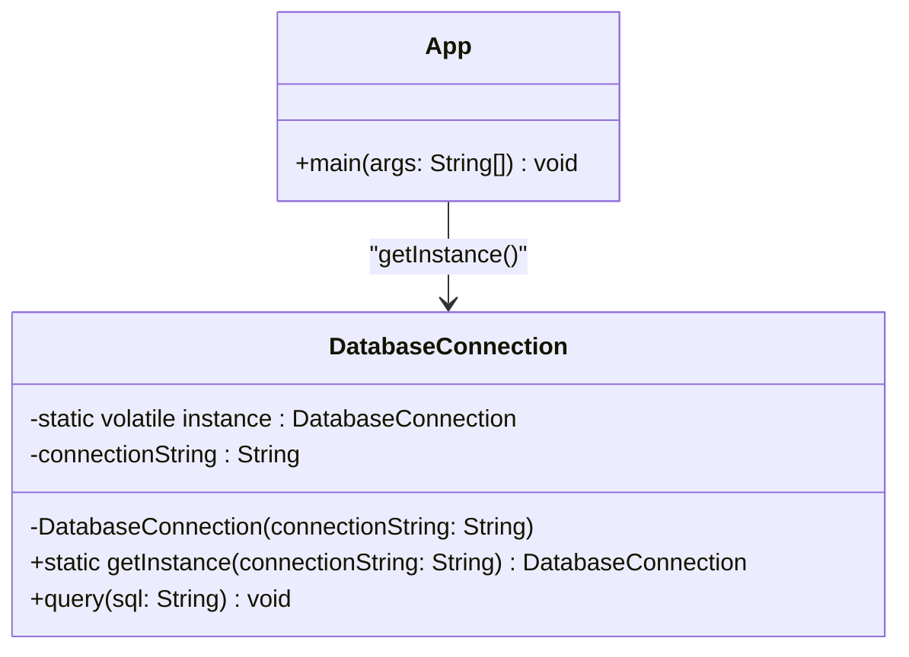
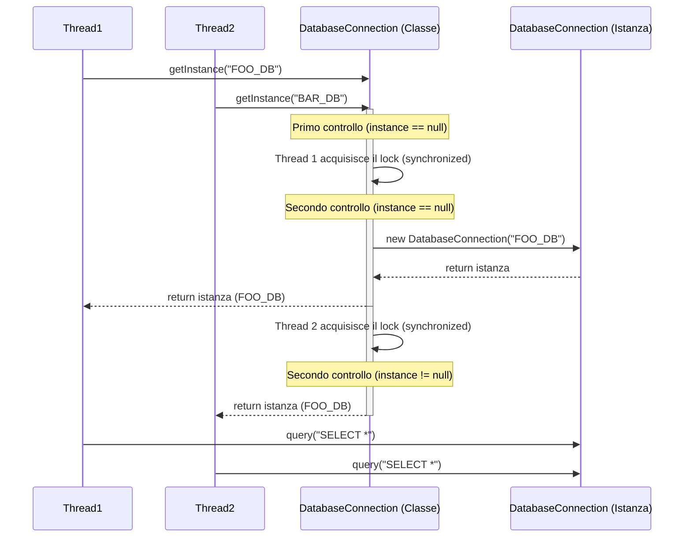

# Implementazione Java: Singleton

## Scenario
Implementazione di una **Connessione al Database**. Aprire una connessione è un'operazione costosa; per questo motivo, ci assicuriamo che in tutta l'applicazione (anche in presenza di più thread) venga creata una e una sola istanza della classe `DatabaseConnection`.

## Struttura Specifica (UML delle Classi)

## Diagramma di Sequenza
Il diagramma mostra cosa succede quando due Thread tentano di ottenere contemporaneamente l'istanza del database, illustrando il comportamento del Double-Checked Locking.

## Spiegazione dell'Implementazione (Thread-Safe)
L'implementazione in Java, specialmente in contesti multi-thread, richiede alcune accortezze particolari, adottando la tecnica del **Double-Checked Locking** (blocco a doppio controllo):
1.  **Variabile `volatile`:** L'istanza statica privata `instance` viene dichiarata `volatile`.
2.  **Costruttore privato:** Il costruttore è privato per inibire l'istanziazione diretta.
3.  **Metodo `getInstance()`:** Esegue i due controlli per evitare la sovrascrittura in multithreading come mostrato nel diagramma di sequenza.
