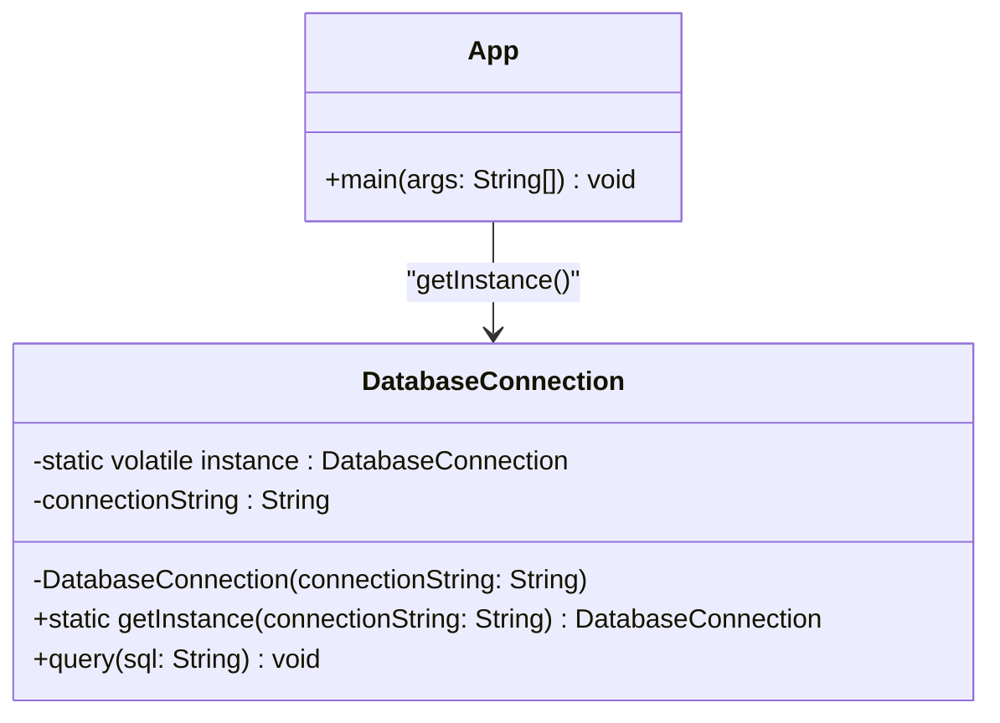

# Implementazione Java: Singleton

## Scenario
Implementazione di una **Connessione al Database**. Aprire una connessione è un'operazione costosa; per questo motivo, ci assicuriamo che in tutta l'applicazione (anche in presenza di più thread) venga creata una e una sola istanza della classe `DatabaseConnection`.

## Struttura (UML)

## Spiegazione dell'Implementazione (Thread-Safe)
L'implementazione in Java, specialmente in contesti multi-thread, richiede alcune accortezze particolari, adottando la tecnica del **Double-Checked Locking** (blocco a doppio controllo):
1.  **Variabile `volatile`:** L'istanza statica privata `instance` viene dichiarata `volatile`. Questo garantisce che le modifiche apportate da un thread siano immediatamente visibili agli altri thread, prevenendo letture parziali durante l'inizializzazione.
2.  **Costruttore privato:** Il costruttore di `DatabaseConnection` è privato per inibire l'istanziazione diretta.
3.  **Metodo `getInstance()`:** 
    *   Esegue un **primo controllo** `if (instance == null)` senza lock. Questo garantisce prestazioni elevate perché il lock viene attivato solo la primissima volta.
    *   Se l'istanza è nulla, entra in un blocco `synchronized (DatabaseConnection.class)`.
    *   Esegue un **secondo controllo** `if (instance == null)` all'interno del blocco sincronizzato. Questo è vitale: se due thread superano il primo controllo contemporaneamente, il primo thread crea l'oggetto; il secondo, appena acquisisce il lock, vede grazie al secondo controllo che l'oggetto esiste già, evitando di sovrascriverlo.