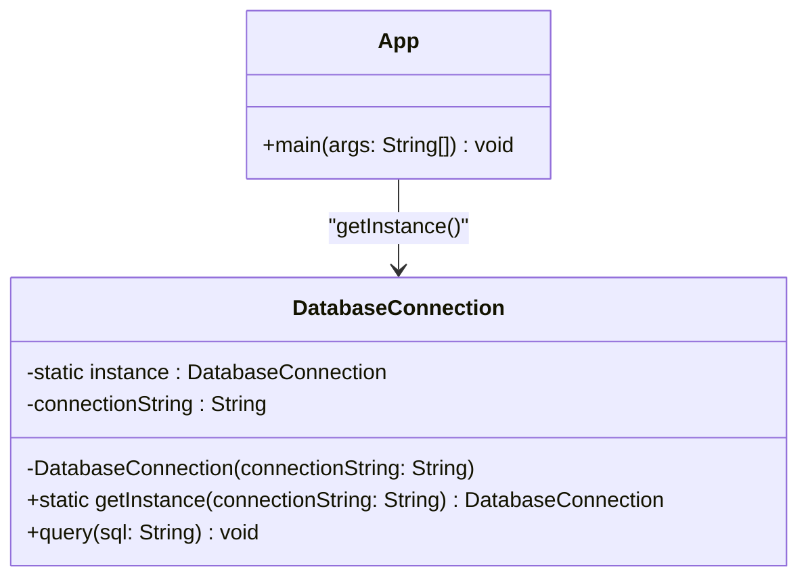

# Singleton

## Descrizione
Il **Singleton** è un design pattern creazionale che garantisce che una classe abbia una sola istanza e fornisce un punto di accesso globale a tale istanza. Questo pattern assicura che in tutto il ciclo di vita dell'applicazione non vengano mai creati due oggetti dello stesso tipo per quella specifica classe.

## Motivazione (Uso e Scenario)
Il Singleton risolve due problemi contemporaneamente (violando tecnicamente il principio di singola responsabilità):
1. **Garantisce che ci sia un'unica istanza di una classe:** Questo è fondamentale quando si controlla l'accesso a una risorsa condivisa, come un file di configurazione, un gestore della cache o una connessione a un database.
2. **Fornisce un punto di accesso globale:** Permette a qualsiasi parte dell'applicazione di accedere a quell'istanza senza doverla passare esplicitamente come parametro ovunque.

### Scenario Reale
Immaginiamo di dover gestire la **connessione al database** della nostra applicazione. Aprire una nuova connessione verso il database è un'operazione molto lenta e dispendiosa in termini di risorse. Se ogni parte dell'applicazione che deve eseguire una query creasse un nuovo oggetto `DatabaseConnection`, si esaurirebbero rapidamente le connessioni disponibili sul server e le prestazioni crollerebbero.
Con il pattern Singleton, l'oggetto `DatabaseConnection` viene creato solo alla prima richiesta. Tutte le richieste successive (e da qualsiasi thread) riceveranno esattamente la stessa istanza e riutilizzeranno la stessa connessione fisica.

## Struttura (UML concettuale)

### Descrizione dei Componenti UML e Interazioni
*   **DatabaseConnection (Singleton):** La classe che implementa il pattern. Contiene un'istanza statica privata di se stessa e un costruttore privato per impedire a chiunque di usare l'operatore `new` dall'esterno. Fornisce un metodo statico pubblico (`getInstance()`) per restituire l'unica istanza consentita.
*   **App (Client):** Richiede l'istanza del Singleton tramite il metodo statico esposto e la utilizza per eseguire la logica di business (es. eseguire query).

## Spiegazione dell'Implementazione
L'implementazione in Java, specialmente in contesti multi-thread, richiede alcune accortezze particolari, adottando la tecnica del **Double-Checked Locking** (blocco a doppio controllo):
1.  **Variabile `volatile`:** L'istanza statica privata `instance` viene dichiarata `volatile`. Questo garantisce che le modifiche apportate da un thread siano immediatamente visibili agli altri thread, prevenendo letture parziali durante l'inizializzazione.
2.  **Costruttore privato:** Il costruttore di `DatabaseConnection` è privato per inibire l'istanziazione diretta.
3.  **Metodo `getInstance()`:** 
    *   Esegue un primo controllo `if (instance == null)` senza lock. Questo garantisce prestazioni elevate perché il lock viene attivato solo la primissima volta.
    *   Se l'istanza è nulla, entra in un blocco `synchronized (DatabaseConnection.class)`.
    *   Esegue un **secondo controllo** `if (instance == null)` all'interno del blocco sincronizzato. Questo è vitale perché due thread potrebbero aver superato contemporaneamente il primo controllo. Il primo thread entra, crea l'oggetto; il secondo entra e, grazie al secondo controllo, vede che l'oggetto esiste già, evitando di sovrascriverlo.

## Conseguenze
Analisi dei pro e dei contro derivanti dall'adozione del pattern:
*   **Vantaggi:**
    *   **Sicurezza dell'istanza unica:** Si ha la certezza assoluta di avere una sola istanza della classe.
    *   **Punto di accesso globale:** Qualsiasi punto del codice può accedere all'istanza senza bisogno di costruttori o parametri.
    *   **Inizializzazione ritardata (Lazy Initialization):** L'oggetto viene inizializzato solo quando viene richiesto per la prima volta, risparmiando memoria se non dovesse mai essere usato.
*   **Svantaggi:**
    *   **Viola il Principio di Singola Responsabilità:** La classe ha due responsabilità: gestire il proprio ciclo di vita (creazione/unicità) e implementare la logica di business (es. gestire il database).
    *   **Nasconde il cattivo design:** Può fungere da "variabile globale mascherata", incoraggiando un accoppiamento troppo stretto tra le varie parti dell'applicazione.
    *   **Difficoltà nel testing:** I Singleton rendono molto complesso lo Unit Testing, poiché molti framework di testing si basano sull'ereditarietà e la creazione dinamica di oggetti mock, cosa bloccata dal costruttore privato e dai metodi statici.