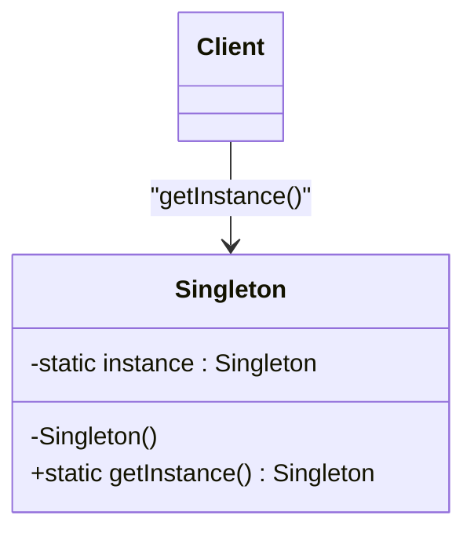

# Singleton

## Descrizione
Il **Singleton** è un design pattern creazionale che garantisce che una classe abbia una sola istanza e fornisce un punto di accesso globale a tale istanza. Questo pattern assicura che in tutto il ciclo di vita dell'applicazione non vengano mai creati due oggetti dello stesso tipo per quella specifica classe.

## Motivazione (Uso e Scenario)
Il Singleton risolve due problemi contemporaneamente:
1. **Garantisce che ci sia un'unica istanza di una classe:** Fondamentale quando si controlla l'accesso a una risorsa condivisa (es. file di configurazione, cache, connessione a un database).
2. **Fornisce un punto di accesso globale:** Permette a qualsiasi parte dell'applicazione di accedere a quell'istanza senza doverla passare esplicitamente.

## Struttura Generale (UML concettuale)

### Descrizione dei Componenti UML Generali
*   **Singleton:** La classe che implementa il pattern. Contiene un'istanza statica privata di se stessa e un costruttore privato per impedire a chiunque di usare l'operatore `new` dall'esterno. Fornisce un metodo statico pubblico (`getInstance()`) per restituire l'unica istanza consentita.
*   **Client:** Richiede l'istanza del Singleton tramite il metodo statico esposto e la utilizza per eseguire la logica di business.

## Conseguenze
Analisi dei pro e dei contro derivanti dall'adozione del pattern:
*   **Vantaggi:**
    *   **Sicurezza dell'istanza unica:** Si ha la certezza assoluta di avere una sola istanza della classe.
    *   **Punto di accesso globale:** Qualsiasi punto del codice può accedere all'istanza.
    *   **Inizializzazione ritardata (Lazy Initialization):** L'oggetto viene inizializzato solo quando viene richiesto per la prima volta.
*   **Svantaggi:**
    *   **Viola il Principio di Singola Responsabilità:** La classe gestisce sia il proprio ciclo di vita sia la logica di business.
    *   **Nasconde il cattivo design:** Può fungere da "variabile globale mascherata".
    *   **Difficoltà nel testing:** I Singleton rendono complesso lo Unit Testing a causa dello stato condiviso e dei metodi statici.