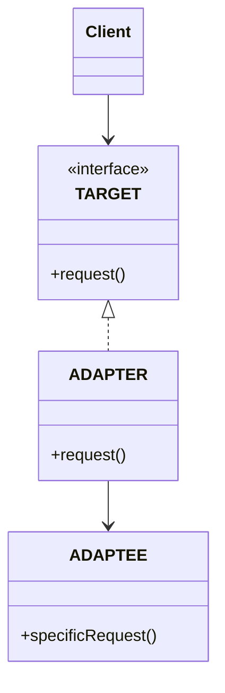
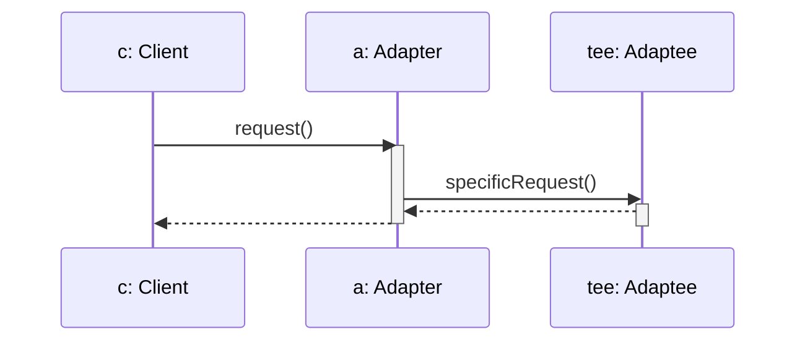
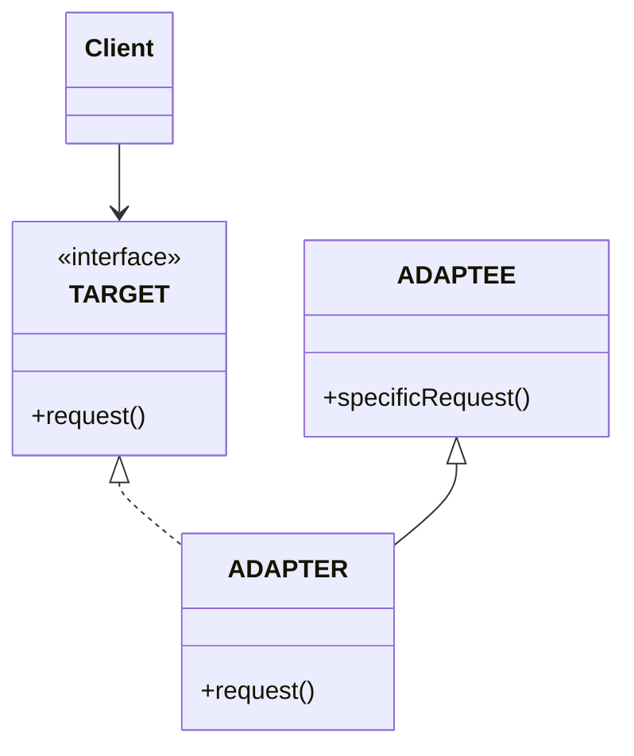

# ADAPTER

## INTENTO
Converte l'interfaccia di una classe in un'altra interfaccia che i client si aspettano. Permette ad alcune classi di interagire eliminando il problema di incompatibilità tra interfacce.

## PROBLEMA
Adapter risolve il problema di incompatibilità di un'interfaccia rispetto a quella dell'applicazione.
Nel caso di classi libreria il problema sussiste nell'eventualità in cui nomenclature di metodi e parametri, o i tipi di quest'ultimi, non corrispondono e non si ha la possibilità di cambiare il codice sorgente delle librerie o viceversa.

## SOLUZIONE
Adattare le chiamate del client alla libreria utilizzata, fa da tramite tra adattatore e client.

## CLASSI COINVOLTE
* **Target**: L'interfaccia che il client si aspetta.
* **Client**: Utilizza oggetti conformi all'interfaccia Target.
* **Adaptee**: Oggetto di libreria che va adattato.
* **Adapter**: Adatta le chiamate del client alla libreria, implementa Target e tiene un riferimento ad Adaptee per invocare i metodi.

## UML DELLE CLASSI

## UML DI SEQUENZA

## CONSEGUENZE
1. Client e Adaptee rimangono indipendenti **(VANTAGGIO)**.
2. Adapter può modificare il comportamento di Adaptee aggiungendo pre-condizioni e post-condizioni.
3. Può implementare Lazy initialization aspettando un'invocazione ad un metodo di adapter prima di istanziarlo **(VANTAGGIO)**.
4. Viene aggiunto un livello di indirettezza visto che una chiamata del Client verso adapter ne scaturisce un'altra, può provocare overhead e rendere il codice più difficile da comprendere **(SVANTAGGIO)**.

## BONUS
* **Class Adapter**: La versione sopra citata è detta *object adapter* in quanto tiene un'istanza di adaptee. Nella versione *class adapter* Adapter estende Adaptee avendo due conseguenze:
    * Rimozione del livello di indirettezza.
    * Adapter a due vie, visto che adesso espone anche i metodi di adoptee oltre che Target.

