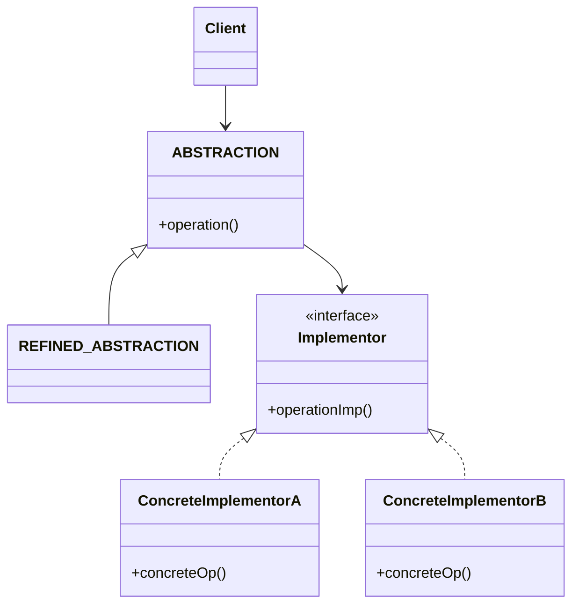
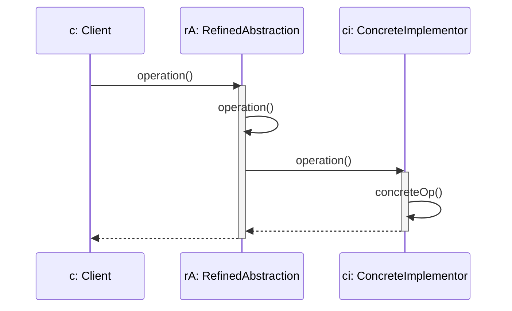

# BRIDGE

## INTENTO
Disaccoppiare un'astrazione dalla sua implementazione così che le due possano variare indipendentemente.

## PROBLEMA
Quando un'astrazione può avere varie implementazioni di solito si usa l'ereditarietà delegando alle sotto-classi le varie implementazioni.
Questo approccio non è flessibile poiché collega astrazioni e implementazioni permanentemente. Rende complesso modificare, estendere e usare astrazioni e implementazioni indipendentemente.
L'estendibilità è persa perché provoca un incremento polinomiale del numero di classi (proliferazione).

## SOLUZIONE
Disaccoppiare astrazione e implementazione facendo da ponte tra l'interfaccia di alto livello e le classi che ne definiscono le operazioni primitive, permettendo alle due gerarchie di evolvere in modo indipendente.

## CLASSI COINVOLTE
* **Abstraction**: Definisce l'interfaccia per il client e mantiene un riferimento ad un oggetto di tipo Implementor al quale inoltra la richiesta del Client.
* **RefinedAbstraction**: Estende l'interfaccia definita da Abstraction.
* **Implementor**: Interfaccia per le classi dell'implementazione, non corrisponde ad Abstraction in quanto implementa operazioni primitive e non ad alto livello (basate su tali primitive) come Abstraction.
* **ConcreteImplementor**: Implementa l'interfaccia di Implementor e fornisce le operazioni concrete.

## UML DELLE CLASSI

## UML DI SEQUENZA

## CONSEGUENZE
1. Implementazione e interfaccia sono indipendenti per cui l'implementazione può essere cambiata a run-time **(VANTAGGIO)**.
2. Il disaccoppiamento evita di ricompilare l'astrazione e il client nel caso l'implementazione cambi **(VANTAGGIO)**.
3. Il client non deve conoscere Implementor, e solo alcune parti del software devono conoscere Abstraction e Implementor **(VANTAGGIO)**.
4. Le gerarchie di Abstraction e Implementor possono evolvere indipendentemente **(VANTAGGIO)**.
5. L'architettura particolare aggiunge un livello di indirezione impattando leggermente sulle performance e rendendo il codice meno intuitivo **(SVANTAGGIO)**.