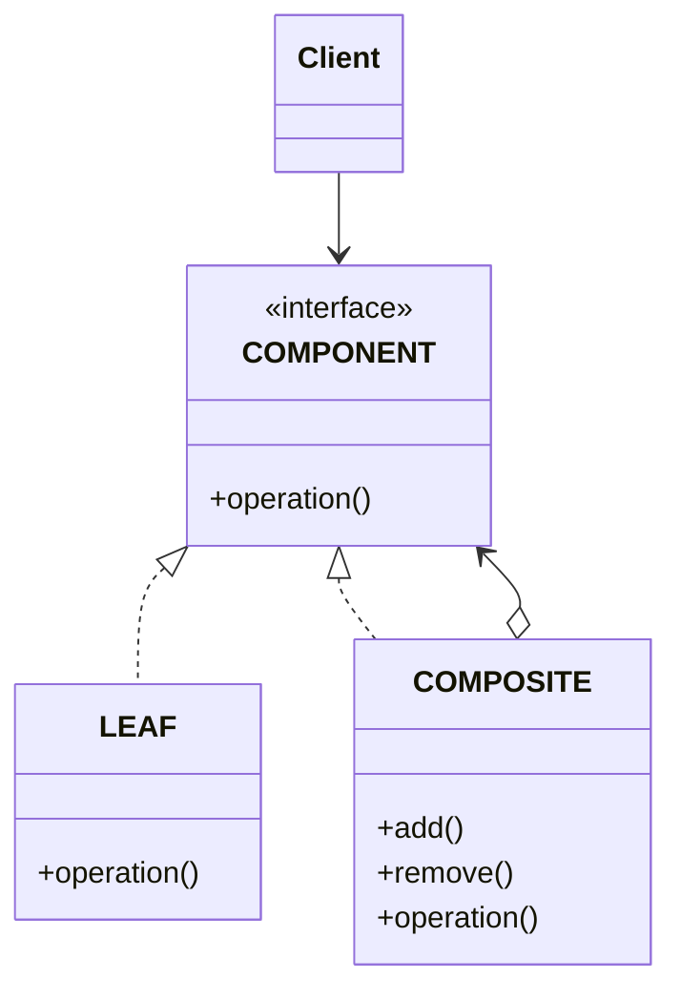
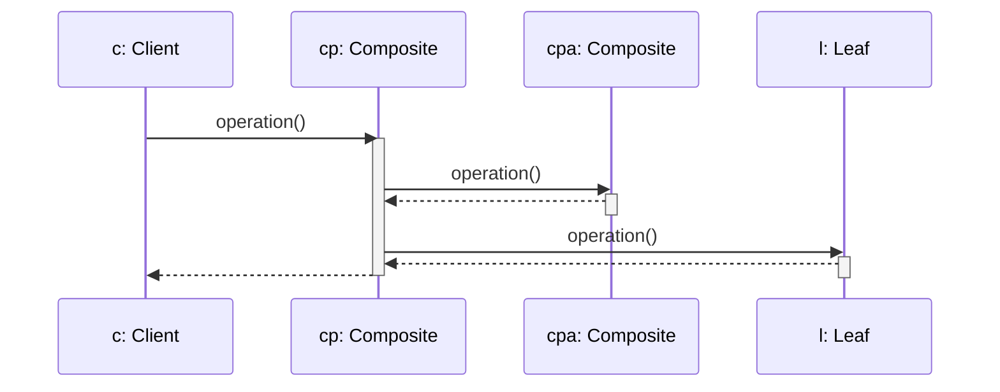

# COMPOSITE

## INTENTO
Comporre oggetti in strutture ad albero per rappresentare gerarchie di parti o del tutto. Permette ai client di trattare oggetti singoli e composizioni di oggetti uniformemente.

## PROBLEMA
Composite risolve il problema della distinzione tra classi di elementi semplici ed un utilizzo differente di classi che raggruppano tali elementi che solitamente prevedono parte del client.
Inoltre permette di gestire una composizione ricorsiva permettendo al client di trattare tutti gli oggetti uniformemente.

## SOLUZIONE
Fornire un'interfaccia unica per classi semplici e classi contenitore. Quest'ultime gestiranno le classi semplici attraverso la stessa interfaccia per garantire la composizione ricorsiva.

## CLASSI COINVOLTE
* **Component**: Interfaccia che rappresenta classi semplici e contenitore, per le quali definisce le operazioni comuni, di accesso e gestione degli elementi semplici ed eventualmente per l'accesso al padre delle strutture ricorsive.
* **Leaf**: Classe che rappresenta componenti semplici, sottoclasse di component che implementa il comportamento degli oggetti semplici.
* **Composite**: Classe che rappresenta componenti contenitori, sottoclasse di component che definisce le operazioni per la gestione degli oggetti child tenendo un riferimento per ciascuno di essi.

## UML DELLE CLASSI

## UML DI SEQUENZA

## CONSEGUENZE
1. Si può ottenere la composizione ricorsiva **(VANTAGGIO)**.
2. Un client che si aspetta un componente semplice potrebbe ricevere un componente composto **(SVANTAGGIO)**.
3. I client trattano uniformemente Leaf e Composite **(VANTAGGIO)**.
4. Nuovi Leaf / Component sono aggiungibili facilmente **(VANTAGGIO)**.
5. Non è possibile vincolare un composite ad accettare solo certi Leaf senza controlli a runtime **(SVANTAGGIO)**.

## BONUS
* **Operazioni a cascata**: Se un client riceve un leaf la richiesta è direttamente gestita, altrimenti il composite invia la richiesta ai suoi child.
* **Trasparenza vs Sicurezza**: Se il component definisce le operazioni di gestione (add e remove) si ha trasparenza ma un client potrebbe chiamarle su un leaf. Se invece sono definite sul composite si ha sicurezza ma si perde trasparenza.