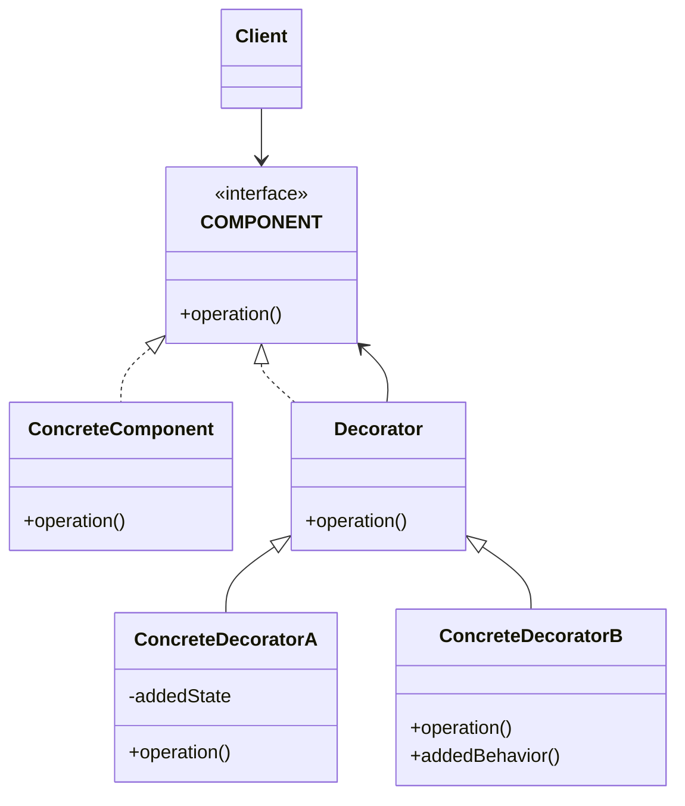
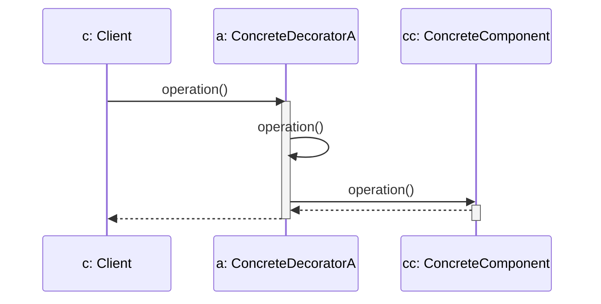

# DECORATOR

## INTENTO
Aggiungere ulteriori responsabilità ad un oggetto dinamicamente fornendo un'alternativa flessibile all'implementazione di sottoclassi per estendere le funzionalità.

## PROBLEMA
Decorator risolve il problema di voler aggiungere responsabilità ai singoli oggetti e non alle classi.
Il problema sussiste quando non è praticabile la creazione di sottoclassi in quanto il numero di estensioni necessiterebbe un numero esagerato di sottoclassi per gestire tutte le combinazioni.

## SOLUZIONE
Wrappare l'oggetto da "decorare" con un altro allo scopo di aggiungere ad esso responsabilità e che quindi può anche essere sottratto dinamicamente.

## CLASSI COINVOLTE
* **Component**: definisce l'interfaccia per gli oggetti che si vogliono decorare.
* **Concrete Component**: definisce l'oggetto da decorare implementando l'interfaccia component.
* **Decorator**: Mantiene un riferimento a component e implementa l'interfaccia component mantenendo la conformità che permette il wrapping. Di solito è astratta per evitare l'istanziazione.
* **Concrete Decorator**: implementa le responsabilità aggiuntive da dare al component wrappato.

## UML DELLE CLASSI

## UML DI SEQUENZA

## CONSEGUENZE
1. Maggiore flessibilità consente l'aggiunta dinamica **(VANTAGGIO)**.
2. La stessa responsabilità può essere aggiunta più volte **(VANTAGGIO)**.
3. I concrete decorator sono indipendenti e si evita il sovraccarico di responsabilità per le classi in cima alla gerarchia che si avrebbe con l'ereditarietà **(VANTAGGIO)**.
4. Concrete Decorator e Concrete Component hanno identità diverse, quindi non confrontabili i riferimenti **(SVANTAGGIO)**.
5. Tanti piccoli oggetti che differiscono nel modo in cui sono interconnessi **(SVANTAGGIO)**.