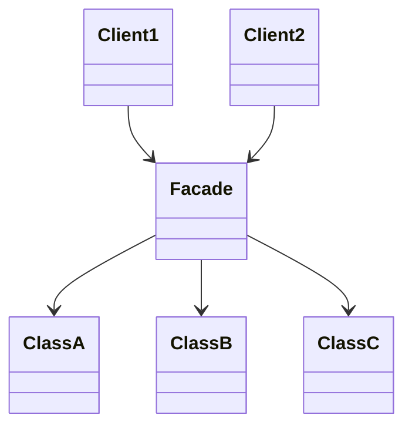
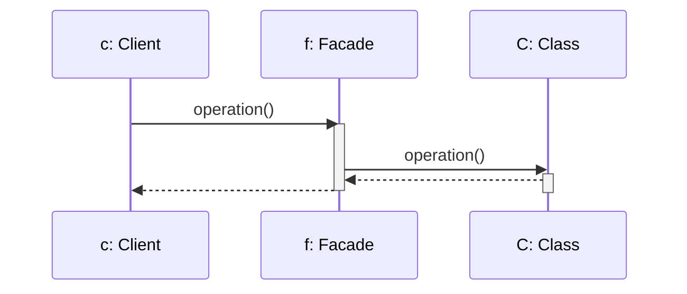

# FACADE

## INTENTO
Fornire un'interfaccia di alto livello e unificata al posto di un insieme complesso di interfacce all'interno di un Sottosistema con l'obiettivo di renderlo più semplice da utilizzare.

## PROBLEMA
Facade risolve il problema nel capire quale sia l'interfaccia essenziale per i client per comunicare con l'insieme di classi del sottosistema.
Si hanno molte classi e si vogliono ridurre le dipendenze dirette tra client e sottosistema.

## SOLUZIONE
Fornire un'interfaccia unica e semplificata ai client per interagire facilmente con il Sottosistema.

## CLASSI COINVOLTE
* **Facade**: Fornisce un'interfaccia semplificata ai client nascondendo gli oggetti del Sottosistema, riducendo la complessità dell'interfaccia e delle chiamate. È Facade che si occupa di invocare i metodi degli oggetti che nasconde.
* **Client**: Interagisce solo con l'oggetto Facade.

## UML DELLE CLASSI

## UML DI SEQUENZA

## CONSEGUENZE
1. Nasconde ai client l'implementazione del sottosistema **(VANTAGGIO)**.
2. Promuove l'accoppiamento debole tra client e sottosistema **(VANTAGGIO)**.
3. Riduce le dipendenze a tempo di compilazione per cui cambiando una classe del sottosistema si ricompila fino al facade escludendo i client **(VANTAGGIO)**.
4. Non previene l'uso di client complessi che necessitano di accedere al Sottosistema **(SVANTAGGIO)**.

## BONUS
* **Annidamento**: Per prevenire l'accesso ai client delle classi del sottosistema, quest'ultime possono essere annidate dentro al facade.